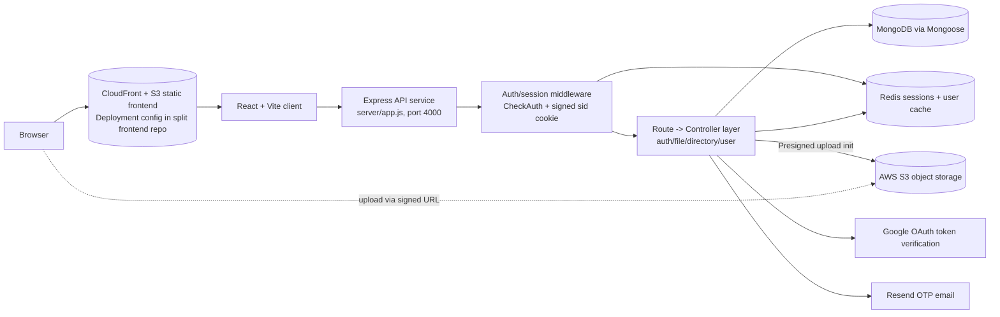

# Cloudosphere

Cloudosphere is a secure cloud file-storage and management platform for uploading, organizing, downloading, and managing files in a per-user directory hierarchy.

## Why Cloudosphere (vs a basic file server)

Compared with a simple “upload/download” file host, this codebase adds:

- Deployed 15+ secure REST API endpoints on AWS EC2, enabling concurrent file uploads, downloads with avg response time sub-500ms under load, with session-based auth and user specific RBAC.
- Architected a hierarchical file management system on AWS S3 supporting flat and folder-based structures, hardened against SQL injection, DoS, CSRF, and invalid uploads via rate limiting, input sanitization, and strict CORS policies.
- Accelerated frontend delivery by serving the entire frontend from AWS S3 and integrating AWS CloudFront CDN, reducing page load latency to sub-100ms compared to direct server serving across all static assets.
- Automated the full deployment lifecycle by building a CI/CD pipeline using GitHub Actions with automated testing and health checks on AWS EC2, enabling zero-downtime deployments and eliminating manual release effort entirely.

---

## Feature snapshot

### Implemented in this checkout

- Registration + login (`/auth/register`, `/auth/login`)
- Google login endpoint (`/auth/login-with-google`) and Google OAuth client integration
- OTP send/verify endpoints and frontend OTP verification flow
- Folder navigation with route-based directory views + breadcrumb rendering
- File upload/download/rename/delete UI + backend handlers
- Directory create/rename/delete UI + backend handlers
- User/profile retrieval and role-gated user listing/logout/delete routes
- Storage usage/quota fields and upload-size checks in backend logic
- Redis-backed session validation for authenticated route groups
- S3 presigned upload initiation endpoint (backend service exists)


---

## Technology stack

| Layer | Technology | Role in project | Evidence |
|---|---|---|---|
| Frontend | React 18 | UI screens and routing | `client/package.json`, `client/src/*` |
| Frontend tooling | Vite | Dev server and build | `client/package.json` scripts |
| Frontend styling | Tailwind CSS | Styling/UI utility classes | `client/package.json`, `client/src/*` |
| Frontend HTTP | Axios | API clients with/without credentials | `client/src/api/axiosInstances.js` |
| Backend runtime | Express | REST API and middleware pipeline | `server/app.js` |
| Data store | MongoDB + Mongoose | Users/files/directories/OTP/session models | `server/Models/*`, `server/Middleware/db.js` |
| Cache/session store | Redis (`redis` client + JSON/FT ops) | Session and cached-user lookup | `server/util/redis.js`, `server/Middleware/auth.js` |
| Object storage integration | AWS S3 SDK + presigner | Signed upload URL generation | `server/services/generateS3Url.js` |
| OAuth | `google-auth-library` | Google ID token verification | `server/services/googleAuthService.js` |
| Auth hardening | `bcrypt` | Password hashing and comparison | `server/Controllers/auth.controller.js` |
| Validation | `zod` | Request payload validation | `server/validators/*` |
| Email | `resend` | OTP email sending utility | `server/util/resend.js` |
| Security middleware | `cookie-parser`, `cors`, `helmet` (imported) | Signed cookies + CORS (Helmet currently not enabled) | `server/app.js` |
| Delivery/CDN (split repo) | S3 + CloudFront | Frontend static hosting/invalidation in related frontend repo workflow | `naveen-1105/cloudStorageApp-frontend` `.github/workflows/deploy.yml` |
| CI/CD (split repos) | GitHub Actions | Deployment automation in related backend/frontend repos | related repos’ `.github/workflows/deploy.yml` |

---

## Architecture



> **Note:** CloudFront/S3 hosting and GitHub Actions deployment are documented in the related split repositories, not in this monorepo’s tracked workflow files.

---

## Backend request flow and data relationships

1. Client calls API.
2. For protected route groups (`/directory`, `/file`, `/user`), `CheckAuth` reads signed cookie `sid`.
3. Middleware fetches `session:${sid}` from Redis; rejects if missing.
4. Middleware loads user (MongoDB) and optionally serves cached `user:${userId}` from Redis.
5. Controller executes ownership/role checks and business logic.

### Data model relationships

- **User** stores `rootDirId`, role, and quota (`maxSizeAllocated`).
- **Directory** stores `userId`, `parentDirId`, aggregate `size`, and `path` ancestry array.
- **File** stores `userId`, `parentDirId`, extension, size, and upload flags.
- **OTP** stores per-email OTP values with TTL expiration.
- **Session model** exists (Mongo TTL schema), while main auth middleware currently uses Redis session records.

---

## Repository layout (annotated)

```text
Cloudosphere/
├── client/
│   ├── src/
│   │   ├── api/                # Axios instances + auth/directory/file/user API modules
│   │   ├── components/         # Breadcrumb, list items, modals, context menu, header
│   │   ├── context/            # Directory context provider/hooks
│   │   ├── App.jsx             # Router definitions
│   │   ├── DirectoryView.jsx   # Main file manager screen (upload, rename, delete, breadcrumbs)
│   │   ├── Login.jsx           # Login + Google login UI
│   │   ├── Register.jsx        # Registration + OTP flow + Google login UI
│   │   └── UsersPage.jsx       # Role-sensitive user management view
│   └── package.json
├── server/
│   ├── Controllers/            # Route handlers for auth, files, directories, users
│   ├── Middleware/             # Auth, role checks, DB connection, ID validator
│   ├── Models/                 # Mongoose models (User, File, Directory, OTP, Session)
│   ├── routes/                 # Route groups mounted in app.js
│   ├── services/               # S3 presigned URL + Google auth service
│   ├── util/                   # Redis + Resend helpers
│   ├── validators/             # Zod schemas for auth/name payloads
│   ├── config/setup.js         # MongoDB collMod JSON schema setup helper
│   ├── app.js                  # Express bootstrap and route mounting
│   └── package.json
└── README.md
```

### Related repositories

Accessible related repositories appear to be split deployment variants of this monorepo:

- `naveen-1105/cloudStorageApp-backend` ≈ backend subset (`server/`-like layout, includes deploy script + workflow)
- `naveen-1105/cloudStorageApp-frontend` ≈ frontend subset (`client/`-like layout, includes deploy script + workflow)

The folder structures and file naming closely correspond to this monorepo modules.

---

## Local setup (fresh clone)

### Prerequisites

- Node.js (version compatible with package locks)
- MongoDB running and reachable
- Redis running (`redis://localhost:6379` is currently hard-coded)

### 1) Start backend (Terminal A)

```bash
cd /home/runner/work/Cloudosphere/Cloudosphere/server
npm install
npm run dev
```

Backend listens on **port 4000** (`server/app.js`).

Optional DB schema setup helper:

```bash
npm run setup
```

### 2) Start frontend (Terminal B)

```bash
cd /home/runner/work/Cloudosphere/Cloudosphere/client
npm install
npm run dev
```

Vite default local port is typically **5173** (script uses `vite --host`).

---

## Environment/configuration variables

### Confirmed from source

| Variable | Used by | Purpose | Status |
|---|---|---|---|
| `mongo_url` | server | Main Mongo connection (`connectDB`) | Required |
| `mongoose_url` | server | Used by `Middleware/mongoose.js` helper | Optional/legacy in current mount path |
| `s3_bucket_name` | server | S3 bucket for presigned uploads | Required for S3 flow |
| `client_id` | server | Google token verification audience | Required for Google login |
| `resend_url` | server | Resend API key/token for OTP email | Required for OTP email send |
| `VITE_BACKEND_BASE_URL` | client | API base URL for Axios clients | Required |
| `VITE_GOOGLE_CLIENT_ID` | client | Google OAuth provider client ID | Required for Google UI login |
| `AWS_ACCESS_KEY_ID`, `AWS_SECRET_ACCESS_KEY`, `AWS_REGION` | Typical AWS SDK credentials/region for S3 presigned URL generation when not using instance role |

## API route groups (from route files)

> Route groups `/directory`, `/file`, and `/user` are mounted behind `CheckAuth` in `server/app.js`.

### `/auth` (public + protected mix)

- `POST /auth/register`
- `POST /auth/login`
- `POST /auth/send-otp`
- `POST /auth/verify-otp`
- `POST /auth/login-with-google`
- `POST /auth/logout` (requires auth)
- `POST /auth/logout-all` (requires auth)

### `/directory` (authenticated)

- `GET /directory/:id?` (list/open directory)
- `GET /directory/breadcrumb/:id` (breadcrumb data)
- `POST /directory/:parentDirId?` (create directory)
- `PATCH /directory/:id` (rename)
- `DELETE /directory/:id` (recursive delete)

### `/file` (authenticated)

- `POST /file/:parentDirId?` (stream upload)
- `POST /file/s3uploadInitiate/:parentDirId?` (presigned upload init)
- `GET /file/:id` (view/download with query option)
- `PATCH /file/:id` (rename)
- `DELETE /file/:id` (delete)

### `/user` (authenticated; role-specific subroutes)

- `GET /user/` (current user)
- `GET /user/get-all-users` (role middleware)
- `POST /user/logout/:id` (role middleware)
- `POST /user/delete-user/:id` (role middleware)

---

## Security and reliability notes

### Implemented controls (evidence-based)

- Password hashing via `bcrypt` on registration.
- Signed, HttpOnly cookie (`sid`) for session key transport.
- Redis-backed session checks in auth middleware.
- Ownership checks in multiple file/directory handlers.
- Input validation using Zod schemas (auth and rename payloads).
- Mongo `collMod` JSON schema helper script (`config/setup.js`).
- File-size and user-quota checks in upload handlers.
- Partial upload cleanup logic (`req.close`/`req.error` paths in file upload flow).

---

## Deployment and CI/CD status

### In this monorepo checkout

- No `.github/workflows` files found.
- No root-level `deploy.sh` scripts found.

### In related split repositories (accessible)

- `cloudStorageApp-backend`: has `deploy.sh` and `.github/workflows/deploy.yml` (EC2 SSH + PM2 reload flow).
- `cloudStorageApp-frontend`: has `deploy.sh` and `.github/workflows/deploy.yml` (build, S3 sync, CloudFront invalidation).

So deployment automation appears to be maintained in split repos rather than this monorepo snapshot.

---

## Intended / reported deployment characteristics (requires operational verification)

The following claims were provided by the project owner and are included as **reported goals/characteristics**, not independently benchmarked in this checkout:

- 15+ secure REST endpoints with concurrent upload/download/share-link behavior and sub-500ms average response under load.
- Hierarchical AWS S3 storage with protections against SQL injection/DoS/CSRF/invalid uploads.
- Frontend served via S3 + CloudFront with sub-100ms static asset latency.
- GitHub Actions-driven zero-downtime deployment with automated tests/health checks.

This repository code confirms many enabling building blocks (auth, validation, S3 integration, role checks), but performance/security SLOs and zero-downtime behavior require runtime/infrastructure validation.

---

## Build, lint, and test commands

### Client

```bash
cd /home/runner/work/Cloudosphere/Cloudosphere/client
npm run dev
npm run build
npm run lint
npm run preview
```

### Server

```bash
cd /home/runner/work/Cloudosphere/Cloudosphere/server
npm run dev
npm run setup
```

> No server lint/test script is currently defined in `server/package.json`.

---

- No explicit project license file is present.

---

## Contributing

1. Fork/branch from latest code.
2. Keep changes focused and evidence-based.
3. Run available lint/build commands for touched areas.
4. Open a PR with clear notes on affected client/server modules.

---

## License

No license file is currently present in this repository. Treat usage and redistribution as **all rights reserved** unless a license is added by the maintainers.
